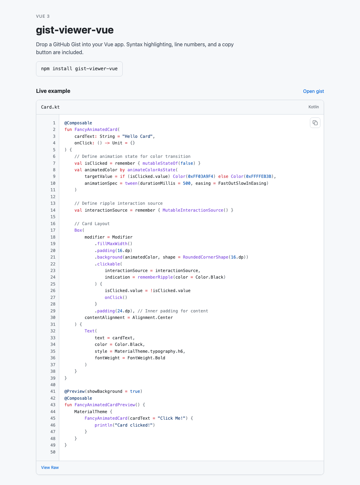

# gist-viewer-vue

[](https://www.npmjs.com/package/gist-viewer-vue)
[](https://github.com/darshitdudhaiya/gist-viewer-vue/actions/workflows/ci.yml)
[](./LICENSE)

Embed a GitHub Gist in Vue 3. Highlighting, line numbers, and copy are built in.

[Live demo](https://darshitdudhaiya.github.io/gist-viewer-vue/)



## Install

```bash
npm install gist-viewer-vue
```

Needs Vue 3.3+.

## Use

```vue
<script setup>
import { GistViewer } from "gist-viewer-vue";
import "gist-viewer-vue/style.css";
</script>

<template>
  <GistViewer gist-url="https://gist.github.com/octocat/abc123" />
</template>
```

A gist id works too:

```vue
<GistViewer gist-url="abc123" file="hello.ts" theme="dark" />
```

## Props

| Prop              | Default  | What it does                                  |
| ----------------- | -------- | --------------------------------------------- |
| `gistUrl`         | required | Gist URL or id                                |
| `file`            | —        | Show only this file                           |
| `theme`           | `auto`   | `light`, `dark`, or `auto`                    |
| `token`           | —        | GitHub token if you hit the 60/hour API limit |
| `showLineNumbers` | `true`   | Show line numbers                             |
| `showFooter`      | `true`   | Show the View Raw footer                      |

## More

**Register globally**

```ts
import { createApp } from "vue";
import GistViewer from "gist-viewer-vue";
import "gist-viewer-vue/style.css";
import App from "./App.vue";

createApp(App).use(GistViewer).mount("#app");
```

**Nuxt 3** — add `plugins/gist-viewer.ts`:

```ts
import { GistViewer } from "gist-viewer-vue";
import "gist-viewer-vue/style.css";

export default defineNuxtPlugin((nuxtApp) => {
  nuxtApp.vueApp.component("GistViewer", GistViewer);
});
```

## License

[MIT](./LICENSE)
